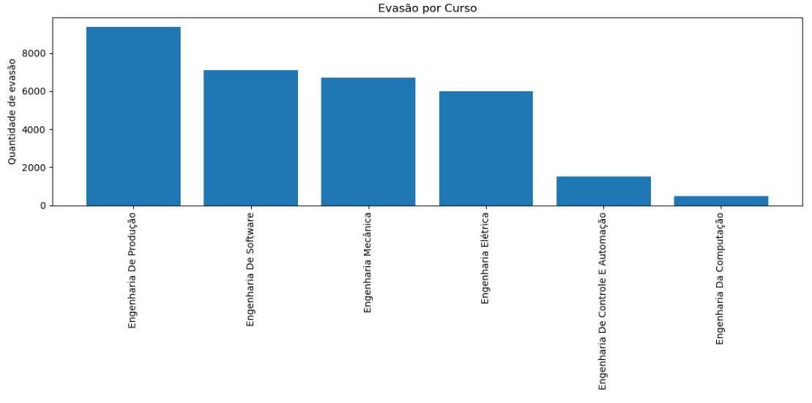
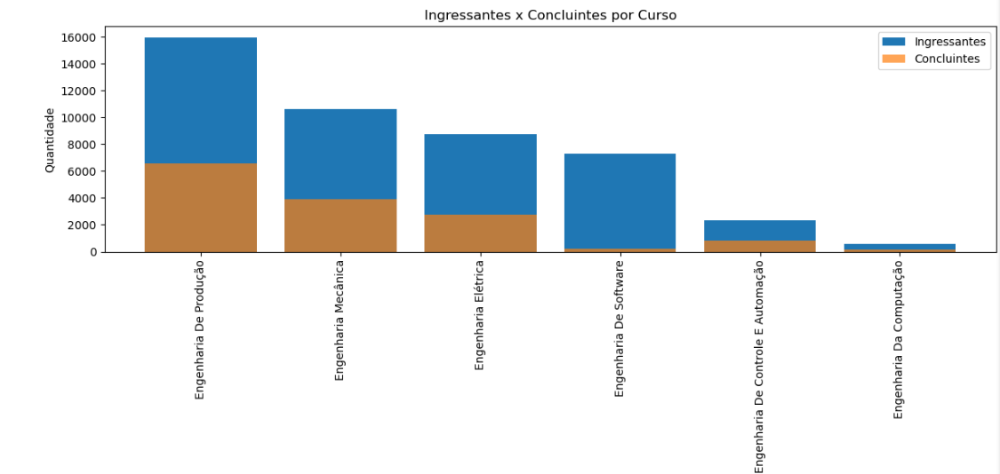

## 📊 Análise de Evasão em Cursos de Engenharia no Estado de São Paulo

Este repositório apresenta uma análise exploratória de dados educacionais com foco na evasão em cursos de engenharia no estado de São Paulo. A partir da comparação entre ingressantes e concluintes, o projeto investiga padrões de abandono e retenção, além de analisar a distribuição dos estudantes por curso e município.

A análise foi desenvolvida em Python, utilizando técnicas de agregação, cálculo de indicadores e visualização de dados para transformar informações brutas em insights relevantes sobre o ensino superior.

---

### 🔍 O que foi analisado

- Comparação entre número de ingressantes e concluintes por curso, permitindo identificar diferenças entre entrada e conclusão
- Evasão por curso de engenharia, com visualização gráfica das taxas de abandono
- Cálculo da evasão em termos absolutos e percentuais
- Análise da evasão por município
- Comparação entre modalidades de ensino (EAD vs Presencial)
- Identificação de cursos e cidades com maior concentração de estudantes

---

### 📈 Visualizações geradas

- Gráfico de evasão por curso

- Gráfico comparativo de ingressantes vs. concluintes por curso

- Gráfico de distribuição de estudantes por município

---

### 📷 Exemplos de visualizações

---

### 📊 Principais insights

- A evasão varia significativamente entre os diferentes cursos de engenharia

- Alguns municípios concentram grande parte da demanda por esses cursos

- A modalidade EAD representa uma parcela relevante das matrículas, indicando mudanças no perfil do ensino superior

---

### 🛠️ Tecnologias utilizadas

- Python

  - pandas

  - matplotlib

  - seaborn

- Jupyter Notebook

---

### 🎯 Objetivo do projeto

Este projeto tem caráter educacional e de portfólio, com foco no desenvolvimento de habilidades em análise exploratória de dados, interpretação de indicadores educacionais e comunicação de resultados por meio de visualizações e relatórios claros.
